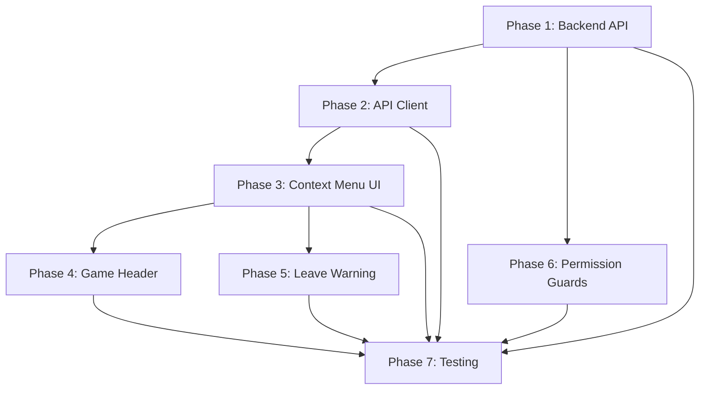

# Co-GM Feature - Context and Key Information

**Last Updated: 2025-10-31**

## Quick Reference

**Feature**: Secondary game master (co-GM) with limited permissions
**Status**: Planning Complete, Ready for Implementation
**Estimated Effort**: 6.5-14 days (depending on resource allocation)

## Key Decisions Made

### User Requirements (Confirmed via Q&A)
1. **Promotion UI**: Context menu on participant cards (three-dot dropdown)
2. **Co-GM Visibility**: Listed in game header alongside primary GM
3. **GM Succession**: Game becomes orphaned if primary GM leaves (no auto-promotion)
4. **Demotion**: Co-GM can be demoted to audience at any time by primary GM

### Permission Model
```
Primary GM > Co-GM > Player > Audience

Primary GM only:
- Edit game settings
- Promote/demote co-GM

Both GM and co-GM:
- Manage phases
- View all actions
- Remove participants

Neither:
- Auto-succession
```

## Critical Files

### Backend Files

**Database Schema**:
- `backend/pkg/db/migrations/20250805170112_add_game_system_tables.up.sql`
  - Lines 26-35: `game_participants` table with `co_gm` role support
  - Line 14: `games.gm_user_id` stores primary GM

**Services**:
- `backend/pkg/db/services/games.go` - Game service (needs new methods)
- `backend/pkg/games/api_participants.go` - Participant management API (needs new handlers)

**Routes**:
- `backend/pkg/http/root.go` - API route registration

**Queries**:
- `backend/pkg/db/queries/games.sql` - SQL queries for sqlc

### Frontend Files

**Permissions**:
- `frontend/src/hooks/useGamePermissions.ts` (lines 6, 86-92)
  - Already has `co_gm` role type
  - Already sets `isCoGM`, `canManagePhases`, `canViewAllActions`
  - Already restricts `canEditGame` to primary GM only

**UI Components**:
- `frontend/src/components/PeopleView.tsx` (lines 102-150)
  - Already renders participants grouped by role
  - Shows "Co GMs" section when co-GM exists
  - Needs context menu integration

**API Client**:
- `frontend/src/lib/api.ts` - Needs new methods

**Types**:
- `frontend/src/types/games.ts` - Game and participant types

## Database Schema Details

### Existing Tables

**games**:
```sql
CREATE TABLE games (
    id SERIAL PRIMARY KEY,
    title VARCHAR(255) NOT NULL,
    gm_user_id INTEGER NOT NULL REFERENCES users(id) ON DELETE CASCADE,
    -- ... other fields
);
```

**game_participants**:
```sql
CREATE TABLE game_participants (
    id SERIAL PRIMARY KEY,
    game_id INTEGER NOT NULL REFERENCES games(id) ON DELETE CASCADE,
    user_id INTEGER NOT NULL REFERENCES users(id) ON DELETE CASCADE,
    role VARCHAR(20) NOT NULL CHECK (role IN ('player', 'co_gm', 'audience')),
    status VARCHAR(20) NOT NULL DEFAULT 'active' CHECK (status IN ('active', 'inactive', 'removed')),
    joined_at TIMESTAMP WITH TIME ZONE DEFAULT NOW(),
    UNIQUE(game_id, user_id)
);
```

### No Schema Changes Required
- The `co_gm` role already exists in the CHECK constraint
- No migrations needed for this feature
- Only need to update participant role values via UPDATE statements

## API Endpoints to Create

### Promote to Co-GM
```
POST /api/v1/games/:id/participants/:userId/promote-to-co-gm

Request: Empty body
Headers: Authorization: Bearer <jwt>

Response (Success): 204 No Content
Response (Forbidden): 403 { "error": "only the primary GM can promote users" }
Response (Invalid): 400 { "error": "target user is not an audience member" }
```

### Demote from Co-GM
```
POST /api/v1/games/:id/participants/:userId/demote-from-co-gm

Request: Empty body
Headers: Authorization: Bearer <jwt>

Response (Success): 204 No Content
Response (Forbidden): 403 { "error": "only the primary GM can demote users" }
Response (Invalid): 400 { "error": "target user is not a co-GM" }
```

## Existing Patterns to Follow

### Backend Permission Check Pattern
From `backend/pkg/games/api_participants.go` (lines 138-151):
```go
// Get requesting user ID from JWT token
userService := &db.UserService{DB: h.App.Pool}
requestingUserID, errResp := core.GetUserIDFromJWT(r.Context(), userService)
if errResp != nil {
    h.App.Logger.Error("Failed to authenticate user from JWT")
    render.Render(w, r, errResp)
    return
}

// Verify requesting user is the GM
game, err := gameService.GetGame(r.Context(), int32(gameID))
if err != nil { /* handle */ }

if game.GmUserID != requestingUserID {
    h.App.Logger.Warn("Non-GM attempted action", "requesting_user_id", requestingUserID)
    render.Render(w, r, core.ErrForbidden("only the GM can perform this action"))
    return
}
```

### Frontend Mutation Pattern
From existing hooks like `useCharacters.ts`:
```typescript
export function usePromoteToCoGM(gameId: number) {
  const queryClient = useQueryClient();

  return useMutation({
    mutationFn: (userId: number) =>
      apiClient.games.promoteToCoGM(gameId, userId),
    onSuccess: () => {
      queryClient.invalidateQueries(['gameParticipants', gameId]);
      queryClient.invalidateQueries(['gameDetails', gameId]);
    },
  });
}
```

### Context Menu Pattern
Look at `RemovePlayerButton.tsx` for confirmation modal pattern:
- Button with loading state
- Confirmation modal before action
- Error handling with toast
- Success callback

## Dependencies Between Tasks



**Critical Path**: Phase 1 → Phase 2 → Phase 3 → Phase 7
**Can Parallelize**: Phase 4, 5, 6 can be done alongside Phase 3

## Testing Strategy

### Test Data Setup
Use existing test fixtures:
- Test GM: `test_gm@example.com`
- Test Player: `test_player@example.com`
- Test Game: Game #2 (from fixtures)

### Backend Test Approach
```go
// Use table-driven tests
func TestPromoteToCoGM(t *testing.T) {
    tests := []struct{
        name           string
        requestingUser int32
        targetUser     int32
        wantErr        bool
        errContains    string
    }{
        {"success - GM promotes audience", gmUserID, audienceUserID, false, ""},
        {"fail - non-GM attempts", playerUserID, audienceUserID, true, "only the primary GM"},
        {"fail - promote player", gmUserID, playerUserID, true, "not an audience member"},
        // ... more cases
    }
}
```

### Frontend Test Approach
```typescript
// Use React Testing Library
describe('ParticipantContextMenu', () => {
  it('shows promote option for audience members', () => {
    render(<ParticipantContextMenu participant={audienceMember} isGM={true} />);
    userEvent.click(screen.getByRole('button', { name: /menu/i }));
    expect(screen.getByText('Promote to Co-GM')).toBeInTheDocument();
  });
});
```

### E2E Test Approach
```typescript
test('GM promotes audience to co-GM', async ({ page }) => {
  await page.goto('/games/2');
  await page.click('text=People');
  await page.click('[data-testid="participant-123-menu"]');
  await page.click('text=Promote to Co-GM');
  await page.click('text=Confirm');
  await expect(page.locator('text=Co-GM: test_audience')).toBeVisible();
});
```

## Edge Cases to Handle

### Business Logic Edge Cases
1. **Multiple co-GMs**: Service should prevent (return error)
2. **Co-GM tries to promote**: UI hides option, API returns 403
3. **Promote non-existent user**: Return 404
4. **Promote user not in game**: Return 400
5. **Primary GM leaves**: Game becomes orphaned, co-GM remains
6. **Co-GM leaves**: Simple participant removal, no special logic

### UI/UX Edge Cases
1. **Rapid clicking**: Disable button during mutation
2. **Network timeout**: Show error, allow retry
3. **Concurrent promotion**: Last-write-wins, handle conflicts gracefully
4. **Mobile view**: Context menu must work on touch devices
5. **Screen reader**: Ensure accessible (ARIA labels)

### Security Edge Cases
1. **JWT expiration during action**: Return 401, redirect to login
2. **Co-GM modifies request to promote self**: Validate on backend
3. **Race condition (GM demotes, co-GM acts)**: Permission check on every request

## Rollback Plan

### If Issues Discovered Post-Deploy

**Option 1: Feature Flag** (if implemented):
- Disable co-GM feature entirely
- Existing co-GMs retain role but promotion disabled

**Option 2: Hotfix**:
- Revert API endpoint changes
- Frontend will show context menu but API calls fail gracefully
- Fix issue, redeploy

**Option 3: Manual Cleanup** (worst case):
- SQL to revert co-GMs to audience:
```sql
UPDATE game_participants
SET role = 'audience'
WHERE role = 'co_gm';
```

## Open Questions (Resolved)

All questions have been answered via user confirmation:
- ✅ UI location: Context menu on participant cards
- ✅ Visibility: Listed in game header
- ✅ Succession: Game becomes orphaned (no auto-promotion)
- ✅ Demotion: Yes, at any time by primary GM

## Related Documentation

- `.claude/context/ARCHITECTURE.md` - Clean architecture patterns
- `.claude/context/TESTING.md` - Testing requirements
- `/docs/adrs/` - Architecture decision records
- `backend/pkg/core/interfaces.go` - Service interfaces
- `CLAUDE.md` - Project setup and workflows

## Next Steps

1. **Start Phase 1**: Backend API implementation
2. **Create feature branch**: `feature/co-gm-support`
3. **Read files**: Review key backend files listed above
4. **Write SQL queries**: Add UPDATE statements for role transitions
5. **Implement service methods**: With full validation logic

---

**Status**: ✅ Ready to begin implementation
**Blockers**: None
**Assigned To**: TBD
