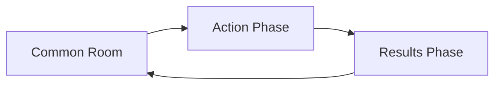

# Understanding Game Phases

ActionPhase games operate in a unique phase-based system that structures gameplay into distinct periods of activity. This guide explains how phases work and what you can do in each one.

## The Phase Cycle

Most ActionPhase games follow a repeating cycle of phases:

This cycle repeats throughout the game, with your GM controlling when to advance between phases.

## Phase Types

### Setup Phase
**When:** Before the game officially starts
**What you can do:**
- View game information
- Wait for GM to configure settings
- See other players who have joined

The Setup phase is when your GM is preparing the game. You can't take any actions yet, but you can see the game details and who else has joined.

### Recruitment Phase
**When:** When the GM is accepting new players
**What you can do:**
- Apply to join the game
- Submit your character concept
- View the game description and requirements
- See how many spots are available

During Recruitment, the GM reviews applications and approves players. Once approved, you'll create your character and wait for the game to start.

### Common Room Phase
**When:** Between action rounds
**Duration:** Set by your GM (often 24-72 hours)
**What you can do:**
- Post in-character messages
- React to other players' posts
- Have conversations and roleplay
- Build character relationships
- Plan strategies with other players
- Share information you've learned

The Common Room is the social hub of your game. Think of it as the tavern, spaceship lounge, or base camp where characters interact between adventures. This is where most roleplay happens.

**Tips for Common Room:**
- Stay in character when posting
- Use the @ mention feature to address specific characters
- React to posts to show your character's emotions
- Check back regularly - conversations move quickly!

### Action Phase
**When:** Time for your character to take action
**Duration:** Set by your GM (typically 24-48 hours)
**What you can do:**
- Submit what your character does
- Edit your draft actions
- Finalize your submission before the deadline
- View the action prompt from your GM

The Action Phase is when you decide what your character actually does. Your GM will provide a prompt or situation, and you respond with your character's actions.

**How to Submit Actions:**
1. Click "Submit Action" on the game page
2. Write what your character does (be specific!)
3. Save as draft to edit later, or submit immediately
4. You can edit drafts until you click "Submit Final"
5. Once submitted as final, you cannot change it

**Action Tips:**
- Be clear and specific about what you're trying to do
- Include your character's thoughts and motivations
- Reference items or abilities you want to use
- Ask your GM if you're unsure what's allowed

### Results Phase
**When:** After all players submit actions
**Duration:** Brief transition period
**What you can do:**
- Read what happened to your character
- See the results of other players' actions
- Learn the consequences of your choices
- Prepare for the next Common Room phase

During Results, your GM publishes the outcomes of everyone's actions. This is when you find out if your plans succeeded, what unexpected things happened, and how the story progresses.

**Reading Results:**
- Your character's results appear at the top
- Scroll down to see what happened to others
- Some results may be private (only you can see them)
- Take note of important information for future actions

## Phase Advancement

Your GM controls when phases advance. They might:
- Set automatic deadlines (e.g., "Action Phase ends in 48 hours")
- Advance manually when everyone is ready
- Wait for all players to submit before advancing
- Use a combination of these methods

**Deadline Notifications:**
- You'll see countdown timers when deadlines are set
- Email notifications remind you of upcoming deadlines (if enabled)
- The game page always shows the current phase and time remaining

## Special Phase Features

### Draft Mode (Action Phase)
During Action Phase, you can save drafts of your action:
- **Draft:** Saved but not final, you can still edit
- **Submitted:** Final version sent to GM, cannot be changed
- **Auto-save:** Your draft saves automatically as you type

### Audience Mode
Some games allow spectators:
- **Audience members** can read Common Room and Results
- They cannot post or submit actions
- Great for learning how games work before joining one

### Character Death
If your character dies:
- You may still read the Common Room and Results
- You cannot post or submit new actions
- Some GMs allow creating a new character to rejoin

## Phase Strategies

### Making the Most of Each Phase

**Common Room Strategy:**
- Coordinate with other players
- Share information your character learned
- Build alliances and relationships
- Set up plans for the next action phase
- Ask questions about the game world

**Action Phase Strategy:**
- Read your GM's prompt carefully
- Consider what your character would realistically do
- Think about consequences before submitting
- Coordinate timing with other players if needed
- Don't wait until the last minute to submit

**Results Phase Strategy:**
- Read everyone's results, not just yours
- Take notes on important information
- Think about how to react in the next Common Room
- Consider how results affect your character's goals

## Common Questions

**Q: What if I miss an Action Phase deadline?**
A: Your character takes no action that round. The GM might describe your character as hesitating, being indecisive, or missing the opportunity.

**Q: Can I change my action after submitting?**
A: Only if it's still a draft. Once you click "Submit Final," it cannot be changed.

**Q: How long do phases typically last?**
A: It varies by game and GM preference:
- Common Room: 24-72 hours typically
- Action Phase: 24-48 hours typically
- Results Phase: Usually immediate transition

**Q: Can I post in Common Room during Action Phase?**
A: No, phases are distinct. You can only post in Common Room during Common Room phase.

**Q: What happens if everyone submits early?**
A: Many GMs advance the phase early if all players have submitted, but some wait for the deadline regardless.

## Tips for New Players

1. **Start in Common Room:** Your first phase is usually Common Room - introduce your character!
2. **Read Everything:** Read all posts and results to understand the story
3. **Ask Questions:** Use Common Room to ask other characters (in character) about the world
4. **Take Notes:** Keep track of important information between phases
5. **Be Patient:** Phases move at their own pace - check in daily but don't expect instant responses
6. **Communicate:** Let your GM know if you'll be away and might miss a deadline
7. **Have Fun:** The phase system creates natural story beats - embrace the rhythm!

## Next Steps

Now that you understand phases, you're ready to:
- [Join your first game](../getting-started/joining-game.md)
- [Create a character](../getting-started/first-character.md)
- [Learn about the Common Room](./common-room.md)
- [Master the Action Phase](./action-phase.md)
