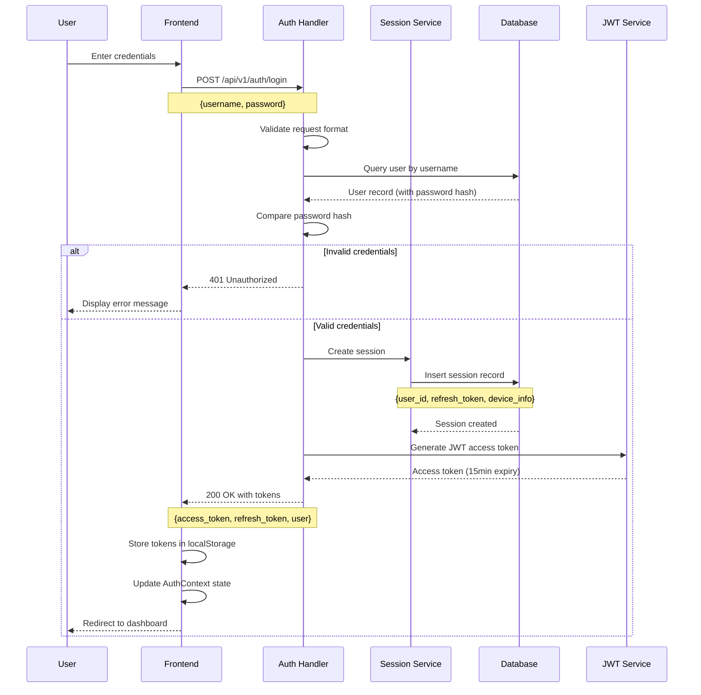
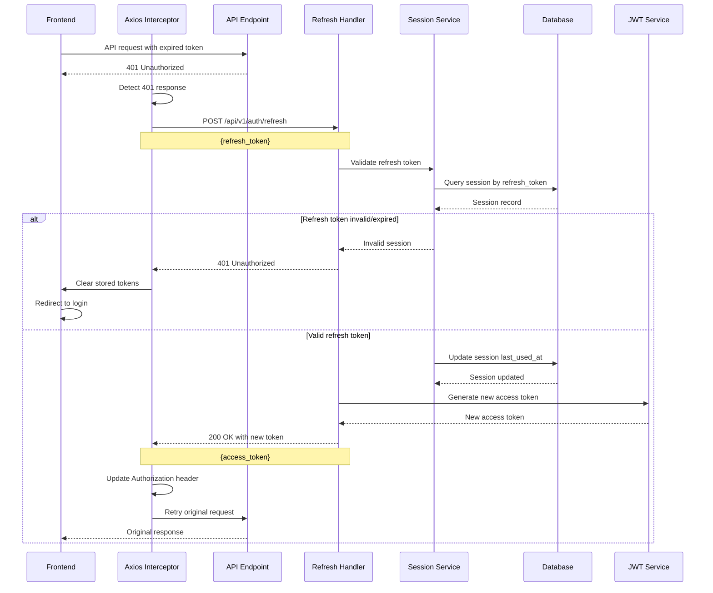
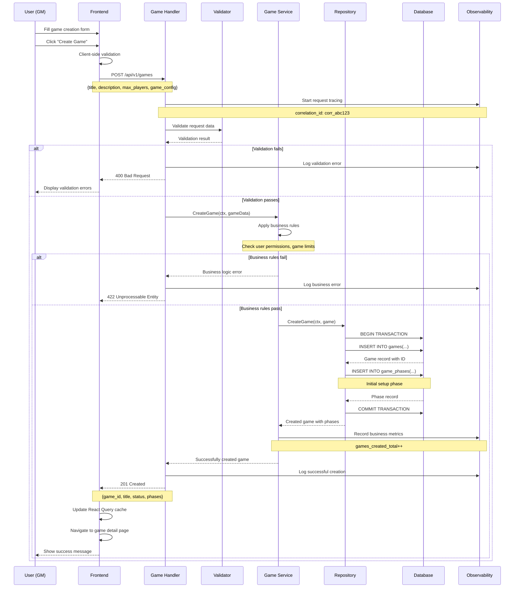
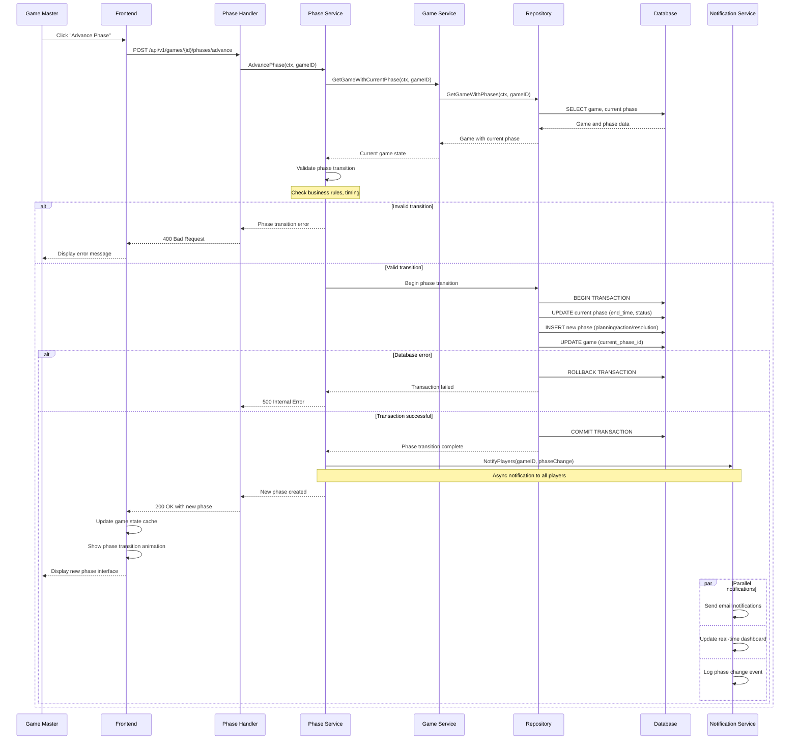
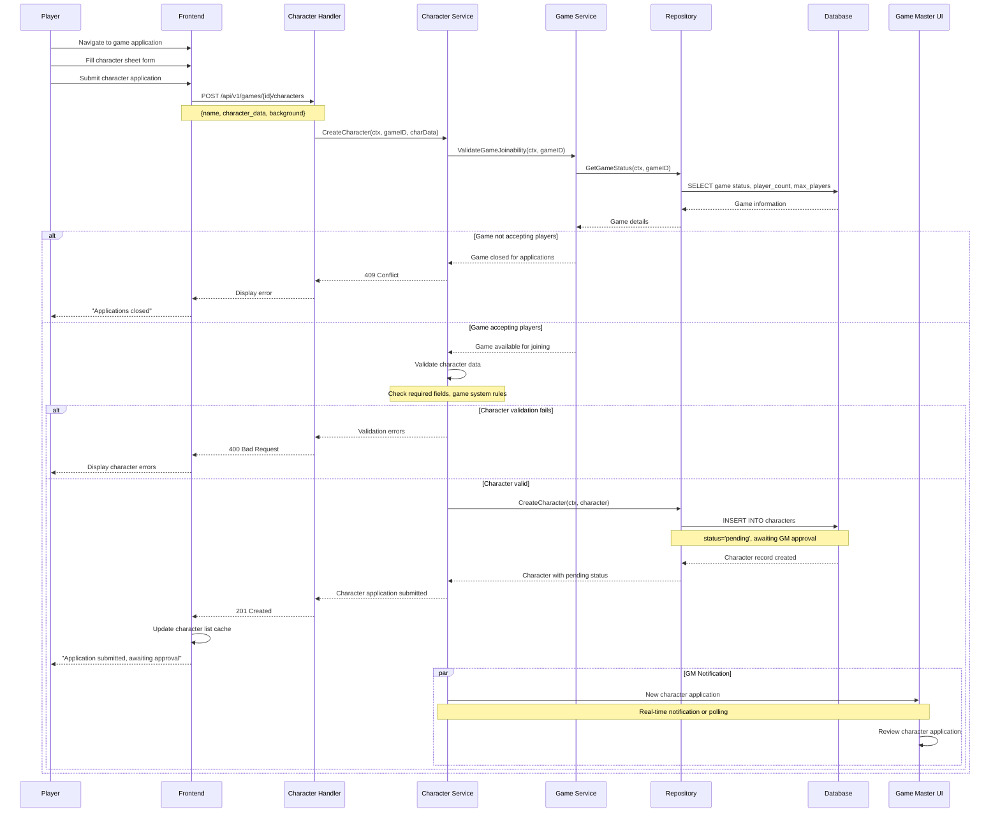
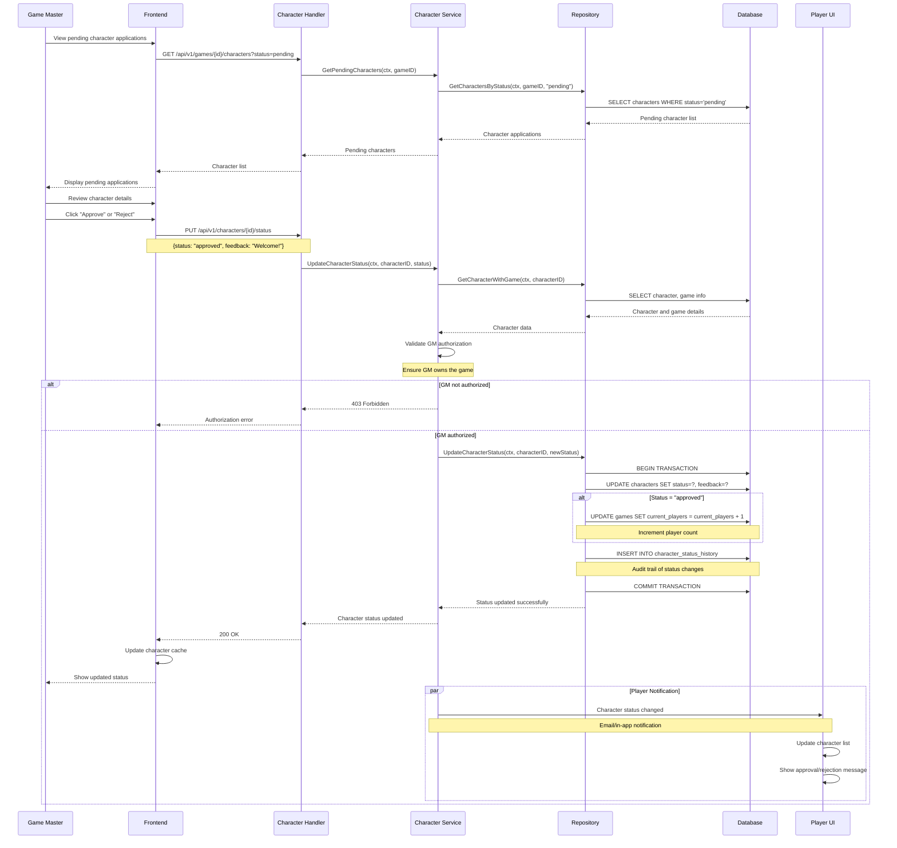
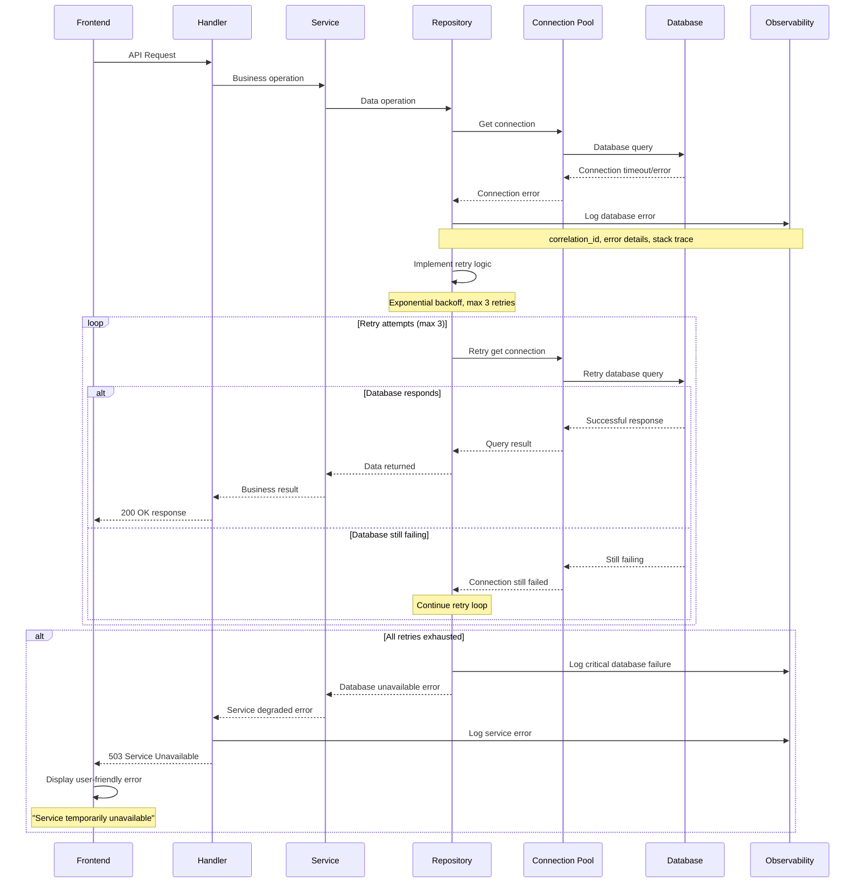
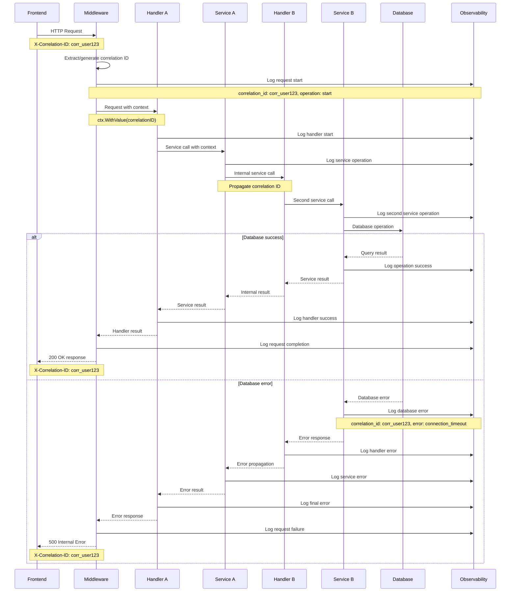
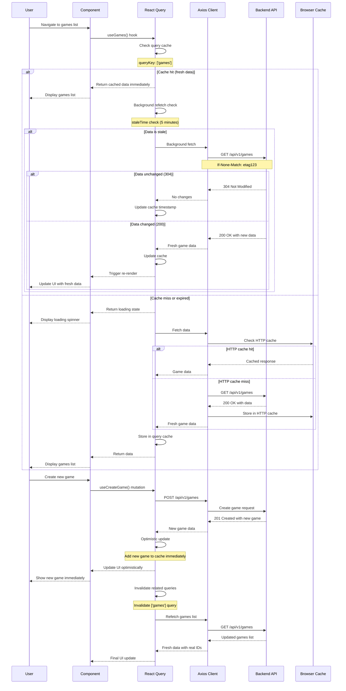
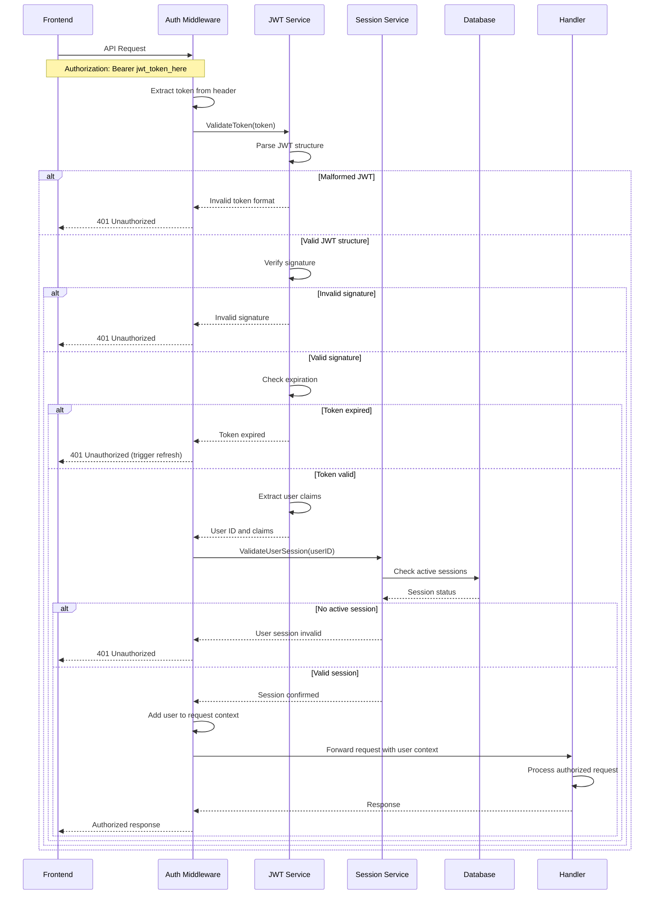

# Sequence Diagrams for Complex Flows

## Overview

This document provides detailed sequence diagrams for the most complex and critical flows in ActionPhase. These diagrams illustrate the step-by-step interactions between system components for key user journeys and system processes.

## 1. User Authentication Flow

### Login Process with JWT Token Management

### Automatic Token Refresh Flow

## 2. Game Creation and Management Flow

### Complete Game Creation Process

### Game Phase Transition

## 3. Character Management Flow

### Character Creation and Approval Process

### Character Approval by GM

## 4. Error Handling and Recovery Flow

### Database Connection Failure Recovery

### Distributed Request Tracing

## 5. Performance Optimization Flow

### React Query Cache Management

## 6. Security Flow Diagrams

### JWT Token Validation Process

These sequence diagrams provide detailed visual representations of the most complex flows in ActionPhase, making it easier for developers to understand system behavior and identify potential issues or optimization opportunities.
